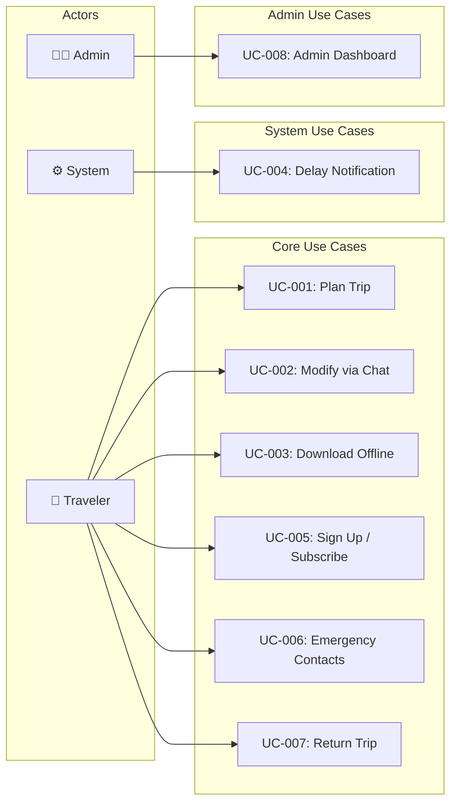

# Use Cases.md

# TravelMate AI — Use Cases

**Version:** 1.0.0  
**Date:** 2026-07-03

---

## UC-001: Plan a Door-to-Door Multi-Modal Trip

**Actor:** Any traveler (authenticated or unauthenticated)  
**Precondition:** User has opened TravelMate AI in a browser  
**Trigger:** User enters origin, destination, and clicks "Plan My Trip"

### Main Success Scenario

1. User enters origin text (e.g., "Navsari")
2. System geocodes origin → coordinates resolved; city name confirmed
3. User enters destination text (e.g., "Trimbakeshwar Temple")
4. System geocodes destination → coordinates resolved; type detected as "temple"
5. User selects travel date from date picker
6. User selects departure preference (morning / afternoon / evening / exact time)
7. User clicks "Plan My Trip"
8. System displays progressive loading indicator with status messages
9. OrchestratorAgent activates:
   - Geocoding confirmed
   - RouteAgent determines transport modes needed (Auto → Train → Bus → Walk)
   - TrainAgent queries RailwayAPI (parallel with WeatherAgent, TempleAgent, HotelAgent)
   - BusAgent queries GTFS for last-mile bus
   - BudgetAgent aggregates all costs
   - ConfidenceValidator checks all claims
10. System displays complete itinerary:
    - Timeline view with 4 legs
    - Map view showing full route
    - Budget panel showing cost breakdown
    - Weather widget for destination
    - Temple information card (timings, puja schedule)
    - Hotel suggestions panel
11. Each data point shows confidence badge (HIGH/MEDIUM/LOW) and source

### Alternative Scenarios

**3a. Destination is ambiguous:**
- System displays disambiguation dialog with top 5 matches
- User selects correct destination
- Flow continues from step 5

**9a. Train API fails:**
- TrainAgent retries 3 times with exponential backoff
- If all retries fail: bus-only alternative planned
- Itinerary displayed with note: "Train schedules unavailable — showing bus route"
- Confidence: LOW on affected legs

**9b. No direct train exists:**
- TrainAgent returns no_trains_found
- RouteAgent recalculates via nearest junction city
- If found: multi-train route displayed
- If not found: bus alternative displayed

**9c. Temple data not in database:**
- TempleAgent returns not_found
- Temple card shows: "Temple timings not available. Please verify directly."
- External link to Google Maps and Google Search provided

**10a. Response takes > 8 seconds:**
- Partial results streamed as available
- Skeleton shows structure; sections fill progressively
- If > 15 seconds with no data: timeout error shown

### Postcondition
- User sees a complete, multi-modal itinerary with confidence scoring
- Trip auto-saved to trip history (if authenticated)
- Trip available for PDF download

---

## UC-002: Modify Itinerary via AI Chat

**Actor:** Authenticated user with a generated itinerary  
**Precondition:** Itinerary is displayed on screen  
**Trigger:** User opens AI chat panel and types a modification request

### Main Success Scenario

1. User opens AI Chat panel (side panel or bottom sheet)
2. User types: "Change my departure to 6 AM"
3. ChatAgent parses intent: `{ type: "change_departure_time", new_time: "06:00" }`
4. ChatAgent returns acknowledgment: "I'll replan your trip for a 6 AM departure."
5. OrchestratorAgent is reinvoked for affected legs only
6. New train options matching 6 AM departure are queried
7. Downstream legs (bus, walking) are recalculated based on new arrival time
8. Updated itinerary replaces old itinerary
9. Changed legs highlighted in the timeline with "Updated" badge
10. Chat shows: "Done! I've updated your trip. Your new train departs at 05:45 from Navsari."

### Alternative Scenarios

**3a. Modification is unclear:**
- ChatAgent asks: "What time would you like to depart? Please specify morning (6–10 AM), afternoon, or an exact time."

**6a. No trains available at new time:**
- ChatAgent responds: "There are no trains departing near 6 AM on this date. The earliest option is 7:45 AM. Would you like me to replan for that?"

---

## UC-003: Download Itinerary for Offline Use

**Actor:** Authenticated user (Explorer tier or above)  
**Precondition:** Itinerary is displayed on screen  
**Trigger:** User clicks "Download Offline"

### Main Success Scenario

1. User clicks "Download Offline" button on itinerary screen
2. System checks subscription tier (must be Explorer or higher)
3. System generates PDF containing:
   - All transport legs with timings, addresses, costs
   - Temple information (timings, dress code)
   - Weather forecast
   - Emergency contacts
   - Map screenshot of full route
4. PDF is downloaded to user's device
5. Itinerary data is cached in browser IndexedDB for app-based offline access
6. Map tiles for the route area are pre-cached
7. Toast notification: "Trip saved for offline access ✓"

### Alternative Scenarios

**2a. User is on Free tier:**
- Modal: "PDF export is available on Explorer plan and above. Upgrade to download."
- Link to upgrade page

**5a. Device storage is full:**
- Error: "Not enough storage to save offline. PDF was downloaded but app cache could not be saved."

---

## UC-004: Receive Train Delay Notification

**Actor:** System (automated)  
**Precondition:** User has a saved trip with a train leg; notifications enabled  
**Trigger:** NTES API reports train delay > 15 minutes

### Main Success Scenario

1. Background Celery task polls NTES for train running status (every 15 minutes for same-day trips)
2. Delay detected: Train 11057 is 45 minutes late
3. NotificationService creates notification record
4. Push notification sent: "Your train 11057 is running 45 minutes late. New ETA: 13:15"
5. User opens notification → navigates to trip view
6. Trip view shows updated train status with new times
7. If delay invalidates next connection (bus):
   - System suggests revised bus timing or alternative

### Alternative Scenarios

**2a. NTES API is unavailable:**
- Task logged as failed; retry in next cycle
- No notification sent (avoid false "On Time" assumption)

---

## UC-005: Sign Up and Subscribe

**Actor:** New user  
**Precondition:** User has used 3 free trips and hit the limit  
**Trigger:** User attempts 4th trip plan on Free tier

### Main Success Scenario

1. User clicks "Plan My Trip"
2. System detects: user has used 3/3 free trips this month
3. Subscription paywall modal appears:
   - Shows current usage: "You've used all 3 free trips this month"
   - Displays tier comparison: Explorer (₹99/mo), Pro (₹249/mo), Business (₹999/mo)
4. User selects "Explorer" and clicks "Subscribe"
5. Supabase checks authentication (redirect to login if needed)
6. Stripe Checkout session created with Explorer price
7. User redirected to Stripe Checkout (hosted page)
8. User enters payment details and submits
9. Stripe webhook fires: `checkout.session.completed`
10. Backend processes webhook:
    - Updates user subscription status in database
    - Supabase metadata updated with tier
11. User redirected back to TravelMate AI
12. Trip plan limit removed; user can continue planning

### Alternative Scenarios

**8a. Payment declined:**
- Stripe shows error on checkout page
- User can retry with different card
- No subscription created

**9a. Webhook delivery delayed:**
- User returns to app but subscription not yet active
- Frontend polls `/api/user/subscription` every 5 seconds for 30 seconds
- When confirmed: access granted
- If still not confirmed after 30s: "Your payment is being processed. Please refresh in a minute."

---

## UC-006: Access Emergency Contacts

**Actor:** Any user (authenticated or not)  
**Precondition:** None (no authentication required)  
**Trigger:** User taps floating emergency button or navigates to /emergency

### Main Success Scenario

1. User taps red emergency button (visible on all screens)
2. Emergency screen displays immediately (no API call needed — cached data):
   - Police: 100
   - Ambulance: 108
   - Fire: 101
   - Railway Police: 1512
   - Women's Helpline: 1091
   - Tourist Helpline: 1800-111-363
3. If GPS permission available:
   - Shows nearest police station (name, address, distance)
   - Shows nearest hospital
   - "Navigate" button opens Google Maps directions
4. One-tap dial buttons for each number

### Alternative Scenarios

**3a. GPS not available:**
- Location-aware services hidden
- Static contacts still fully usable
- Note: "Enable location to find nearby emergency services"

---

## UC-007: Plan a Return Trip

**Actor:** Authenticated user with existing trip  
**Precondition:** User is viewing a completed outward itinerary  
**Trigger:** User clicks "Plan Return Trip"

### Main Success Scenario

1. User clicks "Plan Return Trip" button
2. System pre-fills: origin = previous destination, destination = previous origin
3. Date picker opens with next day pre-selected
4. User selects return date and time preference
5. System plans return trip (same agent flow as UC-001)
6. Return itinerary displayed alongside outward itinerary
7. Both trips saved as a pair in trip history

---

## UC-008: Admin Reviews Usage Dashboard

**Actor:** Admin user  
**Precondition:** User has admin role in Supabase  
**Trigger:** Admin navigates to /admin

### Main Success Scenario

1. Admin opens /admin route
2. Middleware verifies Supabase session + admin role
3. Dashboard displays:
   - Total users (registered, active today)
   - Trips planned today / this week / this month
   - Revenue (MRR, new subscriptions, churn)
   - AI agent performance (avg response time, failure rate)
   - Top routes (most planned origin-destination pairs)
   - Error rate (last 24h)
4. Admin can view individual user trip history (support tool)
5. Admin can manage temple database (add/edit temple timings)
6. Admin can view audit logs

### Alternative Scenarios

**2a. User is not admin:**
- Redirect to /planner with no error message (security by obscurity + auth check)

---

## Use Case Diagram

