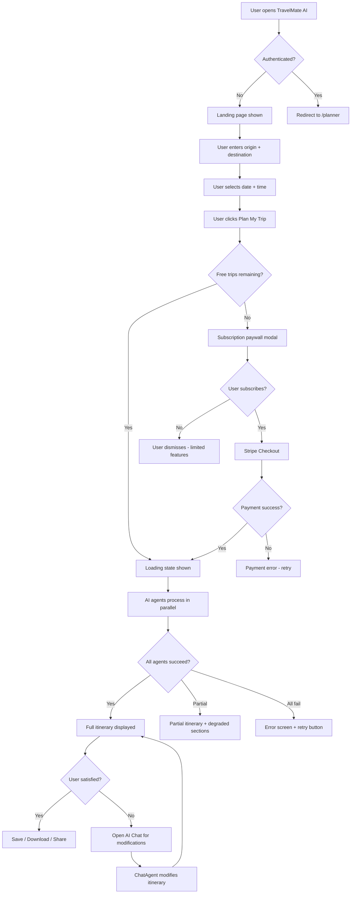
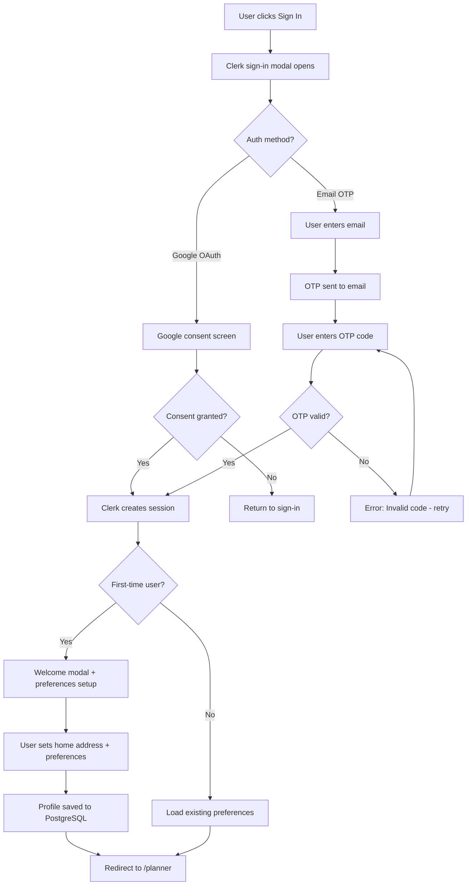
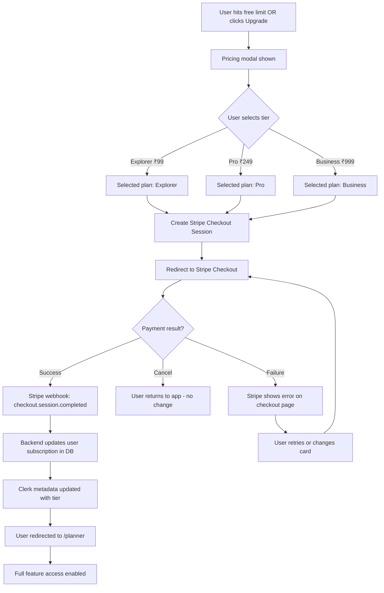
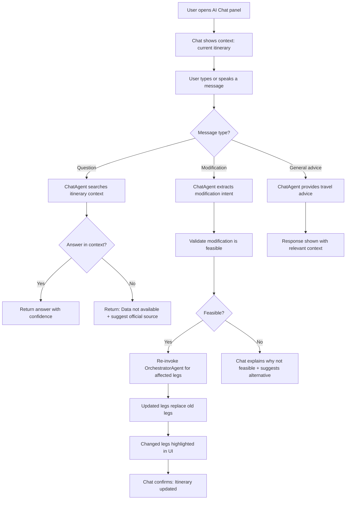
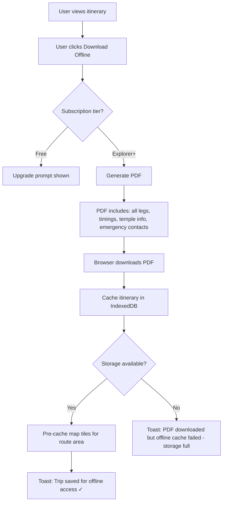
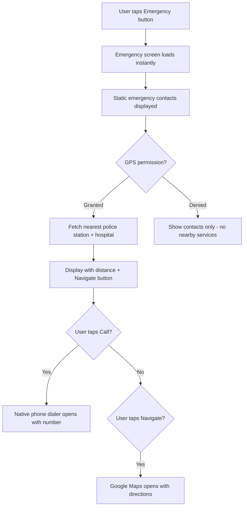
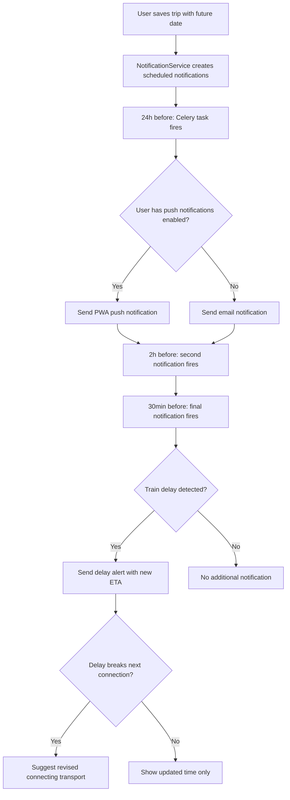
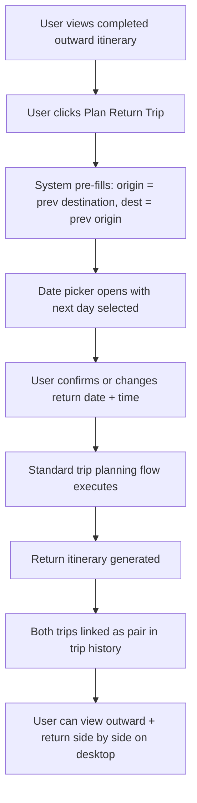

# User Flows.md

# TravelMate AI — User Flows

**Version:** 1.0.0  
**Date:** 2026-07-03

---

## Flow 1: First-Time Trip Planning

---

## Flow 2: Authentication

---

## Flow 3: Subscription Purchase

---

## Flow 4: AI Chat Modification

---

## Flow 5: Offline Download

---

## Flow 6: Emergency Access

---

## Flow 7: Notification Lifecycle

---

## Flow 8: Return Trip Planning

