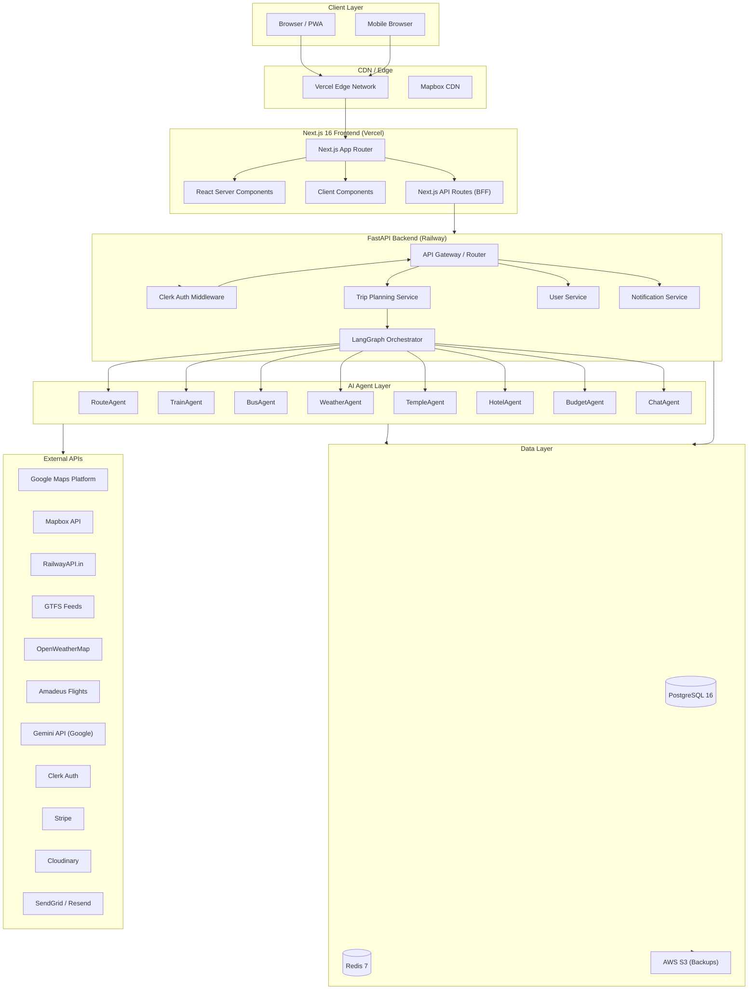
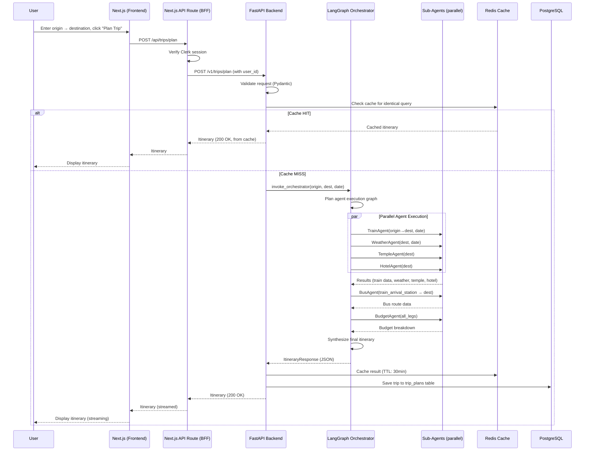
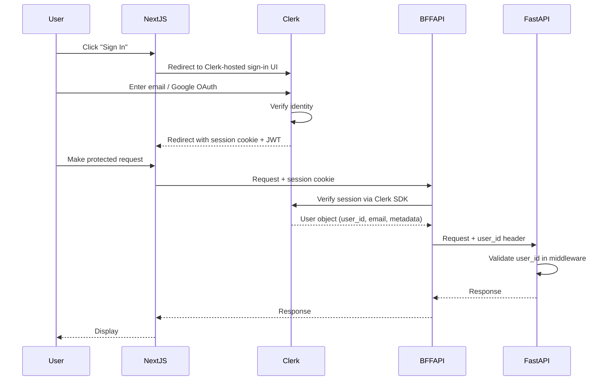

# Architecture.md

# TravelMate AI — System Architecture

**Version:** 1.0.0  
**Date:** 2026-07-03

---

## 1. Architectural Philosophy

TravelMate AI is built on **Clean Architecture** principles with **Domain-Driven Design (DDD)**:

- **Separation of concerns:** Every layer has a single responsibility
- **Dependency inversion:** High-level modules don't depend on low-level details
- **Testability:** Every component is independently testable
- **Scalability:** Stateless services, horizontal scaling ready
- **Observability:** Every request is traceable end-to-end

---

## 2. High-Level Architecture Diagram



---

## 3. Layer Descriptions

### 3.1 Client Layer

Users access TravelMate AI via:
- **Desktop browser** — Primary development target for planning
- **Mobile browser** — Primary consumption target (most Indian users on mobile)
- **Installed PWA** — Added to home screen; enables offline mode and push notifications

### 3.2 Frontend: Next.js 16 on Vercel

**Technology:** Next.js 16 with App Router and React Server Components

**Responsibilities:**
- Server-side rendering of initial page for SEO and performance
- React Server Components for data-heavy sections (reduces JS bundle)
- Client Components for interactive elements (map, chat, forms)
- Backend-for-Frontend (BFF) pattern: Next.js API routes proxy to FastAPI

**BFF Pattern Rationale:**
Next.js API routes act as an adapter between the frontend and FastAPI. This:
1. Hides the FastAPI URL from public exposure
2. Allows Next.js to add Clerk session verification before passing to FastAPI
3. Enables request/response transformation at the edge
4. Simplifies CORS configuration (same-origin requests)

### 3.3 Backend: FastAPI on Railway

**Technology:** Python 3.12 + FastAPI 0.115

**Responsibilities:**
- HTTP API endpoints for all features
- Request validation (Pydantic models)
- Business logic orchestration
- LangGraph agent invocation
- Database operations via SQLAlchemy
- Cache operations via Redis
- External API calls (transport, weather)

**Design Patterns:**
- **Repository Pattern:** `TripRepository`, `UserRepository`, `TempleRepository` — all DB operations
- **Service Layer:** `TripPlanningService`, `NotificationService` — business logic
- **Dependency Injection:** FastAPI `Depends()` for repositories and services
- **CQRS (lightweight):** Separate read and write paths for performance

### 3.4 AI Agent Layer: LangGraph

**Technology:** LangGraph 0.2 + LangChain 0.3 + Gemini 3.5 Flash

**Architecture:** A **Hierarchical Multi-Agent System**

```
OrchestratorAgent (LangGraph State Machine)
├── Analyzes intent and constructs plan
├── Dispatches sub-agents in parallel where possible
├── Aggregates results
└── Synthesizes final itinerary

Sub-Agents (specialized tools):
├── TrainAgent       → RailwayAPI calls
├── BusAgent         → GTFS + Google Transit
├── WeatherAgent     → OpenWeatherMap
├── TempleAgent      → Temple database
├── HotelAgent       → Hotel suggestions
└── BudgetAgent      → Cost calculation
```

Each agent runs within a LangGraph **StateGraph** node. Agents that can run in parallel (Weather + Temple + Hotel) are dispatched concurrently. Train and Bus agents may be sequential if bus depends on train arrival point.

### 3.5 Data Layer

**PostgreSQL 16:**
- Primary OLTP database
- Stores: users, trips, itineraries, preferences, notifications, audit logs
- Read replica for query-heavy endpoints
- Connection pooling via SQLAlchemy connection pool (max 100 connections)

**Redis 7:**
- Cache for: geocoding results, train schedules, weather, AI responses
- Session storage for Celery task status
- Rate limiting counters
- TTLs defined per cache type (see Caching Strategy)

**AWS S3:**
- Database backup destination
- PDF itinerary storage for download links

---

## 4. Request Flow: Trip Planning



---

## 5. Authentication Flow



---

## 6. Architecture Decision Records (ADRs)

### ADR-001: FastAPI over Django for Backend

**Decision:** Use FastAPI (Python) rather than Django or Node.js Express

**Rationale:**
- FastAPI is async-native (critical for concurrent external API calls during trip planning)
- LangGraph and LangChain are Python-native; same language eliminates context switching
- Auto-generated OpenAPI documentation
- Pydantic models shared between API validation and LLM output parsing
- Superior performance vs Django for async workloads

**Trade-offs:**
- Less batteries-included than Django (no built-in admin, auth)
- Smaller ecosystem than Express for some middleware

---

### ADR-002: LangGraph over Custom Agent Framework

**Decision:** Use LangGraph for multi-agent orchestration

**Rationale:**
- LangGraph provides a stateful, resumable agent graph — critical for multi-step trip planning
- Built-in support for parallel agent execution (concurrent sub-agents)
- Checkpointing enables retry from failure points without restarting
- LangSmith integration for agent debugging and tracing
- Active community and support from LangChain team

**Trade-offs:**
- Additional dependency; abstracts some control flow
- Learning curve for engineers unfamiliar with graph-based orchestration

---

### ADR-003: Next.js BFF Pattern

**Decision:** Next.js API routes as Backend-for-Frontend rather than direct browser-to-FastAPI calls

**Rationale:**
- Clerk session verification at the edge (Next.js middleware)
- FastAPI URL not exposed to browser (security)
- Can apply edge caching on Vercel for some responses
- Consistent request/response contracts between frontend and backend

**Trade-offs:**
- Additional hop in request path (~5–10ms latency added)
- More code to maintain in Next.js API routes

---

### ADR-004: PostgreSQL over MongoDB

**Decision:** Use PostgreSQL (relational) rather than MongoDB (document)

**Rationale:**
- Itinerary data has well-defined schemas (trips, legs, users, preferences)
- JOIN operations needed for complex queries (trips + legs + transport_data)
- ACID guarantees critical for payment and user data
- PostgreSQL JSONB columns provide document storage when schema flexibility needed (itinerary details)
- Full-text search for location names via pg_trgm extension

---

### ADR-005: Mapbox for Map Rendering

**Decision:** Use Mapbox GL JS for map rendering, Google Maps for data APIs

**Rationale:**
- Mapbox provides superior map styling control (can match TravelMate brand colors)
- Google Maps JavaScript API has higher cost for embed at scale
- Mapbox's vector tiles are more performant for animated route drawing
- Google Maps Platform still used for Geocoding, Places, Distance Matrix (best data quality)
- Hybrid approach: best of both worlds

---

## 7. Scalability Architecture

### 7.1 Horizontal Scaling

```
Load Balancer (Vercel / Railway)
├── FastAPI Pod 1
├── FastAPI Pod 2
├── FastAPI Pod N (auto-scaled)
└── (Stateless — all state in PostgreSQL + Redis)
```

- All FastAPI pods are stateless
- Sessions stored in Redis (not in-process)
- Auto-scaling trigger: CPU > 70% OR queue depth > 100

### 7.2 Database Scaling

```
PostgreSQL Primary (writes + reads)
└── Read Replica 1 (read-heavy queries: trip history, hotel search)
└── Read Replica 2 (reporting and analytics)
```

### 7.3 Caching Architecture

```
Request → Redis Cache Check → Cache HIT → Return cached response
                           → Cache MISS → Call external API → Store in Redis → Return
```

Cache is the first line of defense for:
- Repeated trip planning queries (same route, same date)
- Geocoding lookups for popular cities
- Train schedules (30-min freshness acceptable)
- Temple data (24-hour freshness)

---

## 8. Deployment Architecture

```
Developer Local
    │ git push
    ▼
GitHub Repository
    │
    ├── GitHub Actions CI
    │   ├── Run tests (Python + TypeScript)
    │   ├── Lint + type check
    │   ├── Security scan (Dependabot + Snyk)
    │   └── Build Docker image
    │
    ├── Vercel (Frontend)
    │   ├── Preview deployment (every PR)
    │   └── Production deployment (main branch)
    │
    └── Railway (Backend)
        ├── Staging environment (develop branch)
        └── Production environment (main branch)
```

---

## 9. Monitoring Architecture

```
Application
├── Sentry (Frontend errors)
├── Datadog APM (Backend traces)
├── Datadog Logs (Structured JSON logs)
├── Datadog Metrics (Custom business metrics)
└── PostHog (User analytics)

Alerts
├── PagerDuty (Critical: error rate, downtime)
├── Slack #engineering (Warning: degraded performance)
└── Email (Non-urgent: weekly digests)
```
