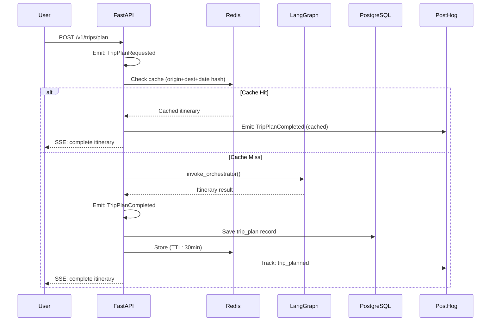
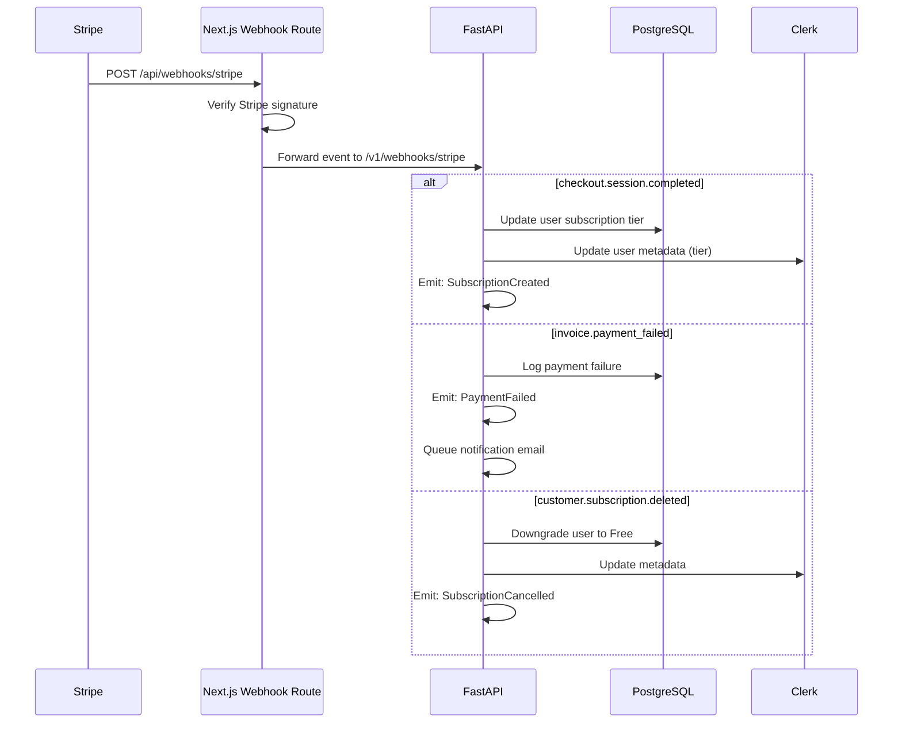
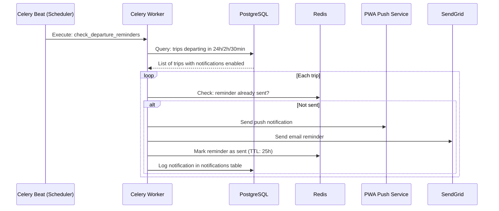

# Event Flow.md

# TravelMate AI — Event Flow

**Version:** 1.0.0  
**Date:** 2026-07-03

---

## 1. Event Types

TravelMate AI uses two event patterns:

| Pattern | Technology | Use Case |
|---|---|---|
| **Domain Events** (in-process) | Python function calls; asyncio | Business logic coordination within monolith |
| **External Events** (webhooks) | HTTP POST webhooks | Stripe, Clerk callbacks |
| **Background Events** | Celery task queue via Redis | Async processing, scheduled tasks |

---

## 2. Domain Event Catalog

### 2.1 Trip Events

| Event | Trigger | Handlers |
|---|---|---|
| `TripPlanRequested` | User submits trip plan request | → CacheService (check cache) → OrchestratorAgent (plan) |
| `TripPlanCompleted` | AI orchestrator returns itinerary | → TripRepository (save) → CacheService (store) → AnalyticsService (log) |
| `TripPlanFailed` | All retries exhausted | → ErrorTracker (log) → UserNotification (show error) |
| `TripSaved` | User saves trip to favorites | → TripRepository (update) → NotificationService (schedule reminders) |
| `TripDeleted` | User deletes a trip | → TripRepository (soft delete) → NotificationService (cancel reminders) |
| `TripDownloaded` | User downloads PDF | → PDFService (generate) → AnalyticsService (log) |

### 2.2 User Events

| Event | Trigger | Handlers |
|---|---|---|
| `UserSignedUp` | Clerk webhook: user.created | → UserRepository (create profile) → WelcomeEmail (send) |
| `UserSignedIn` | Clerk session created | → PreferenceService (load) → AnalyticsService (track) |
| `UserPreferencesUpdated` | User saves profile changes | → UserRepository (update) |
| `UserAccountDeleted` | User requests deletion | → DataPurgeService (72h process) → Clerk (delete) → Stripe (cancel sub) |

### 2.3 Payment Events

| Event | Trigger | Handlers |
|---|---|---|
| `SubscriptionCreated` | Stripe webhook: checkout.session.completed | → UserRepository (update tier) → Clerk (update metadata) → WelcomeEmail |
| `SubscriptionRenewed` | Stripe webhook: invoice.paid | → UserRepository (extend period) |
| `SubscriptionCancelled` | Stripe webhook: customer.subscription.deleted | → UserRepository (downgrade to Free) → Clerk (update) |
| `PaymentFailed` | Stripe webhook: invoice.payment_failed | → UserNotification (payment failed email) |

### 2.4 Notification Events

| Event | Trigger | Handlers |
|---|---|---|
| `DepartureReminderDue` | Celery beat schedule (24h/2h/30min before) | → NotificationService (send push + email) |
| `TrainDelayDetected` | NTES polling task detects delay > 15min | → NotificationService (send alert) → TripService (suggest alternatives) |
| `WeatherAlertIssued` | Weather polling detects severe weather | → NotificationService (send warning) |

---

## 3. Event Flow Diagrams

### 3.1 Trip Planning Event Flow

### 3.2 Stripe Webhook Event Flow

### 3.3 Notification Event Flow

---

## 4. Celery Task Schedule

| Task | Schedule | Description |
|---|---|---|
| `check_departure_reminders` | Every 15 minutes | Find trips needing 24h/2h/30min reminders |
| `poll_train_running_status` | Every 15 minutes | Check NTES for delays on same-day trips |
| `refresh_weather_cache` | Every 1 hour | Refresh weather data for upcoming trips |
| `refresh_train_schedule_cache` | Every 30 minutes | Refresh popular train route caches |
| `cleanup_expired_sessions` | Every 6 hours | Purge expired Redis session data |
| `generate_daily_analytics` | Daily at 00:30 IST | Aggregate daily KPIs |

---

## 5. Webhook Security

### 5.1 Stripe Webhooks

- **Endpoint:** `POST /api/webhooks/stripe`
- **Verification:** `stripe.webhooks.constructEvent()` with webhook signing secret
- **Idempotency:** Each event has a unique `event.id`; stored in processed_events table; duplicate events are ignored
- **Retry:** Stripe retries failed webhooks for up to 72 hours with exponential backoff

### 5.2 Clerk Webhooks

- **Endpoint:** `POST /api/webhooks/clerk`
- **Verification:** Svix signature verification using Clerk webhook secret
- **Events handled:** `user.created`, `user.updated`, `user.deleted`
