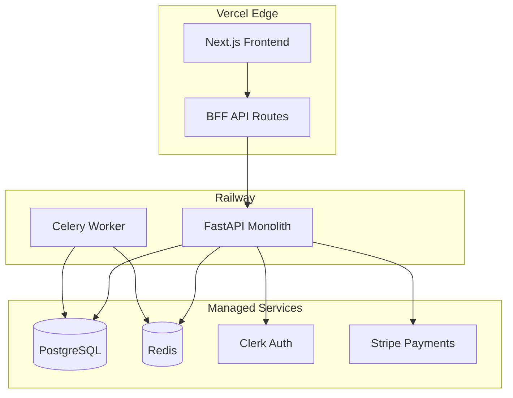
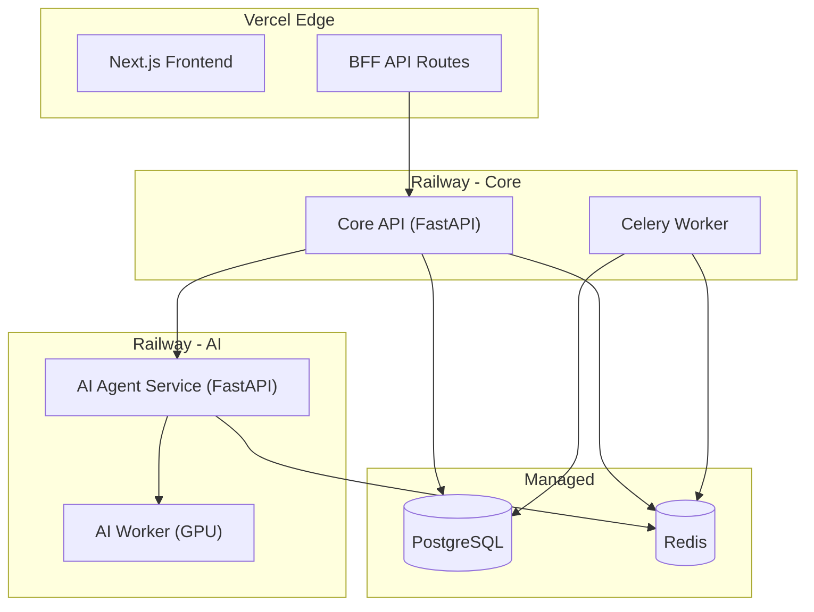

# Microservices.md

# TravelMate AI — Service Architecture

**Version:** 1.0.0  
**Date:** 2026-07-03

---

## 1. Architecture Decision: Modular Monolith (Not Microservices)

TravelMate AI v1.0 uses a **Modular Monolith** pattern — NOT microservices. This is an intentional decision.

### 1.1 Rationale

| Factor | Monolith Advantage | Microservice Disadvantage |
|---|---|---|
| Team size (< 5 engineers) | Single deployable; no service mesh overhead | Operational burden exceeds team capacity |
| Development speed | No inter-service communication complexity | gRPC/HTTP contracts between services slow iteration |
| Debugging | Single process; stack traces span full request | Distributed tracing required; harder to debug |
| Data consistency | Single database; ACID transactions easy | Eventual consistency; saga patterns needed |
| Deployment | One deploy pipeline | N deploy pipelines; version matrix |
| Cost | Single server/container | N containers, load balancers, service mesh |

### 1.2 Monolith Boundaries (Future Extraction Ready)

The modular monolith is organized with clear module boundaries that map to future services:

```
apps/api/app/
├── api/v1/           → API Gateway (future extraction)
├── services/         → Business Logic Services
├── agents/           → AI Agent Service (future extraction)
├── repositories/     → Data Access Layer
└── infrastructure/   → External API Clients
```

### 1.3 Module Boundaries

| Module | Responsibility | Future Service |
|---|---|---|
| `api/v1/trips.py` | Trip planning endpoints | Trip Service |
| `api/v1/chat.py` | AI chat endpoints | Chat Service |
| `api/v1/users.py` | User management | User Service |
| `api/v1/notifications.py` | Notification endpoints | Notification Service |
| `api/v1/admin.py` | Admin endpoints | Admin Service |
| `agents/` (entire dir) | AI agent orchestration | AI Agent Service |
| `tasks/` (entire dir) | Background jobs | Worker Service |

### 1.4 Extraction Criteria

A module should be extracted to a separate service when:
1. It needs to scale independently (e.g., AI agents are CPU/memory intensive)
2. It has a different deployment cadence (e.g., notification templates change weekly)
3. Team grows beyond 8 engineers and ownership boundaries need enforcement
4. The module's failure should not take down other modules

**Expected first extraction (v2.0):** AI Agent Service — it has unique scaling requirements (CPU-heavy, long-running requests) and can benefit from independent scaling.

---

## 2. Current Service Topology



---

## 3. Internal Module Communication

Since all modules run in the same process, communication is via **direct function calls** (not HTTP or message queues):

```python
# Trip planning endpoint calls services directly
async def plan_trip(request: TripPlanRequest):
    geocoded = await geocoding_service.resolve(request.origin)
    itinerary = await trip_planning_service.plan(geocoded, ...)
    await notification_service.schedule_reminders(itinerary)
    return itinerary
```

### 3.1 Async Background Tasks

Celery is used for operations that should not block the HTTP response:

| Task | Trigger | Worker |
|---|---|---|
| Send notification email | Trip saved with notifications enabled | Celery worker |
| Refresh cached transport data | Scheduled (every 30 min) | Celery beat |
| Generate PDF | User requests download (if > 5 seconds) | Celery worker |
| Process Stripe webhook events | Stripe webhook received | Celery worker |

---

## 4. Future v2.0 Service Architecture

When the AI Agent module is extracted:



Communication between Core API and AI Agent Service: **HTTP REST** with circuit breaker pattern.
