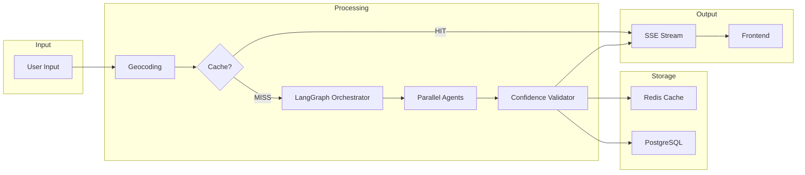

# System Design.md

# TravelMate AI — System Design

**Version:** 1.0.0  
**Date:** 2026-07-03

---

## 1. Design Principles

### 1.1 Clean Architecture

```
┌──────────────────────────────────────────────────┐
│                 Presentation Layer                │
│   Next.js Pages, API Routes, React Components    │
├──────────────────────────────────────────────────┤
│                 Application Layer                 │
│   FastAPI Endpoints, Use Cases, DTOs             │
├──────────────────────────────────────────────────┤
│                  Domain Layer                     │
│   Entities, Value Objects, Domain Events         │
├──────────────────────────────────────────────────┤
│               Infrastructure Layer                │
│   PostgreSQL, Redis, External APIs, AI Agents    │
└──────────────────────────────────────────────────┘
```

**Dependency Rule:** Dependencies point inward only. The Domain layer has ZERO external dependencies. Infrastructure implements interfaces defined by the Domain layer.

### 1.2 SOLID Principles

| Principle | Application in TravelMate AI |
|---|---|
| **Single Responsibility** | Each agent has exactly one job (TrainAgent only does trains). Each service has one domain. |
| **Open/Closed** | New transport modes added by creating a new Agent + Tool without modifying OrchestratorAgent. |
| **Liskov Substitution** | All transport agents implement `BaseTransportAgent` interface; swappable. |
| **Interface Segregation** | Repository interfaces have only the methods each consumer needs. |
| **Dependency Inversion** | Services depend on abstract repository interfaces, not SQLAlchemy models directly. |

### 1.3 Repository Pattern

```python
# Abstract interface (domain layer)
class TripRepository(ABC):
    @abstractmethod
    async def create(self, trip: Trip) -> Trip: ...
    @abstractmethod
    async def get_by_id(self, trip_id: str) -> Trip | None: ...
    @abstractmethod
    async def list_by_user(self, user_id: str, limit: int) -> list[Trip]: ...

# Concrete implementation (infrastructure layer)
class PostgresTripRepository(TripRepository):
    def __init__(self, session: AsyncSession):
        self.session = session
    
    async def create(self, trip: Trip) -> Trip:
        # SQLAlchemy implementation
```

### 1.4 Service Layer

Services contain business logic and orchestrate between repositories and external systems:

```python
class TripPlanningService:
    def __init__(
        self,
        trip_repo: TripRepository,
        orchestrator: AgentOrchestrator,
        cache: CacheService,
        geocoding: GeocodingService,
    ):
        self.trip_repo = trip_repo
        self.orchestrator = orchestrator
        self.cache = cache
        self.geocoding = geocoding

    async def plan_trip(self, request: TripPlanRequest) -> Itinerary:
        # 1. Check cache
        # 2. Geocode locations
        # 3. Invoke AI orchestrator
        # 4. Validate output
        # 5. Save to database
        # 6. Cache result
        # 7. Return itinerary
```

### 1.5 Dependency Injection

FastAPI's `Depends()` provides constructor injection:

```python
async def get_trip_service(
    db: AsyncSession = Depends(get_db_session),
    cache: Redis = Depends(get_redis),
) -> TripPlanningService:
    trip_repo = PostgresTripRepository(db)
    cache_service = RedisCacheService(cache)
    geocoding = GoogleGeocodingService()
    orchestrator = LangGraphOrchestrator()
    return TripPlanningService(trip_repo, orchestrator, cache_service, geocoding)
```

---

## 2. State Management

### 2.1 Frontend State Architecture

| State Type | Technology | Scope | Examples |
|---|---|---|---|
| **Server State** | React Query (TanStack) | Remote data + cache | Trip data, user profile, temple info |
| **Client State** | Zustand | UI state, ephemeral | Selected tab, modal open, theme |
| **URL State** | Next.js router | Route params, search | Trip ID, origin/destination query params |
| **Form State** | React Hook Form | Form inputs | Trip planner form, profile form |
| **Offline State** | IndexedDB | Persisted locally | Downloaded itineraries |

### 2.2 Backend State

The FastAPI backend is **stateless**. All state is externalized:

| State | Storage | Justification |
|---|---|---|
| User sessions | Supabase (hosted) + Redis (cache) | Supabase is the auth source of truth |
| Trip data | PostgreSQL | Durable, queryable |
| Cache | Redis | Fast, evictable |
| AI conversation | Redis (session TTL) | Ephemeral; cleared after 1 hour inactivity |
| Background task status | Redis (Celery result backend) | Celery manages lifecycle |

### 2.3 LangGraph State Machine

The AI agent system uses LangGraph's `StateGraph` with typed state. See `AI Agents.md` for the complete `TripPlanningState` definition.

Key LangGraph state management decisions:
- State is created per request; not persisted between requests
- Checkpointing enabled for retry from failure point
- State reducers used for parallel agent result merging

---

## 3. API Design

### 3.1 Versioned REST API

All endpoints are versioned under `/v1/`:
```
POST /v1/trips/plan          → Plan a new trip
GET  /v1/trips               → List user's trips
GET  /v1/trips/{id}          → Get trip details
DELETE /v1/trips/{id}        → Delete a trip
POST /v1/chat                → Send chat message (SSE stream)
POST /v1/geocode             → Geocode a location
GET  /v1/weather?lat=&lng=   → Get weather forecast
GET  /v1/temples/{id}        → Get temple information
GET  /v1/hotels?lat=&lng=    → Search hotels
```

### 3.2 Response Streaming (SSE)

Trip planning and AI chat use Server-Sent Events for progressive response:

```
POST /v1/trips/plan
→ Content-Type: text/event-stream

data: {"type": "status", "message": "Geocoding locations..."}
data: {"type": "status", "message": "Searching train schedules..."}
data: {"type": "partial", "leg": {...}}  ← first leg ready
data: {"type": "partial", "leg": {...}}  ← second leg ready
data: {"type": "context", "weather": {...}}
data: {"type": "context", "temple": {...}}
data: {"type": "complete", "itinerary": {...}}  ← final result
```

---

## 4. Concurrency Model

### 4.1 Backend Concurrency

FastAPI runs on **uvicorn** with async workers:
- IO-bound operations (API calls, DB queries) use `async/await`
- CPU-bound operations (GTFS parsing) run in `asyncio.to_thread()`
- AI agent parallel dispatch uses `asyncio.gather()` for concurrent agent execution

### 4.2 AI Agent Parallelism

```python
# Parallel agent execution within LangGraph
results = await asyncio.gather(
    train_agent.invoke(state),
    weather_agent.invoke(state),
    temple_agent.invoke(state),
    hotel_agent.invoke(state),
    return_exceptions=True  # Don't fail all if one agent fails
)
```

Agents that can run in parallel: Train + Weather + Temple + Hotel
Agents that are sequential: Bus (depends on train arrival point) → Budget (depends on all legs)

---

## 5. Data Flow Architecture


