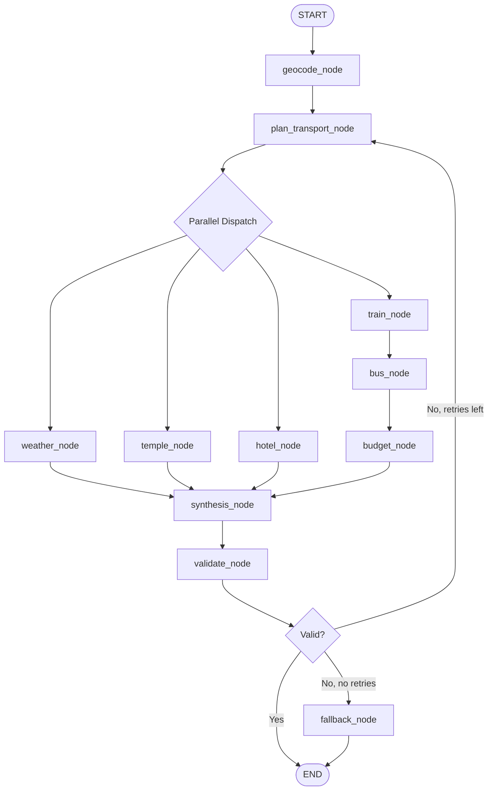

# LangGraph.md

# TravelMate AI — LangGraph Architecture

**Version:** 1.0.0  
**Date:** 2026-07-03

---

## 1. LangGraph Overview

LangGraph is a framework for building stateful, multi-agent applications as directed graphs. TravelMate AI uses LangGraph to orchestrate the multi-agent trip planning workflow.

**Why LangGraph:**
- **Stateful:** Carries `TripPlanningState` through all nodes
- **Parallel execution:** Weather + Temple + Hotel agents run concurrently
- **Conditional routing:** Skip flight agent for short distances
- **Checkpointing:** Resume from failure point without replaying all agents
- **Streaming:** Progressive results via SSE

---

## 2. State Graph Definition



---

## 3. Node Definitions

### 3.1 geocode_node

**Input:** Raw origin and destination text  
**Output:** Geocoded coordinates for both locations  
**Tools:** Google Maps Geocoding API  
**Error Handling:** If geocoding fails, return error immediately (cannot proceed without coordinates)

### 3.2 plan_transport_node

**Input:** Geocoded origin, destination, distance, user preferences  
**Output:** Planned sequence of transport modes  
**Logic:**
```
if distance < 5km:
    plan = [WALK] or [AUTO]
elif distance < 50km:
    plan = [AUTO, BUS, WALK]
elif distance < 300km:
    plan = [AUTO, TRAIN, BUS/AUTO, WALK]
elif distance < 800km:
    plan = [AUTO, TRAIN, BUS/AUTO, WALK]
    also_consider_flight = True
else:
    plan = [CAB, FLIGHT, CAB, WALK]
    also_consider_train = True
```

### 3.3 train_node

**Input:** Origin station, destination station, date  
**Output:** TrainData (list of trains with schedules)  
**Agent:** TrainAgent (see AI Agents.md)  
**Parallel:** Runs in parallel with weather_node, temple_node, hotel_node

### 3.4 bus_node

**Input:** Train arrival station (or origin if no train), final destination  
**Output:** BusData (routes, stops, times)  
**Agent:** BusAgent  
**Sequential:** Runs AFTER train_node (depends on train arrival point)

### 3.5 weather_node / temple_node / hotel_node

Run in parallel. See AI Agents.md for full agent specifications.

### 3.6 budget_node

**Input:** All transport legs from train + bus + auto agents  
**Output:** BudgetBreakdown  
**Sequential:** Runs after all transport agents complete

### 3.7 synthesis_node

**Input:** All agent results (train, bus, weather, temple, hotel, budget)  
**Output:** Complete ItineraryResponse JSON  
**Logic:** Assembles all legs in chronological order, inserts transfer buffers, merges contextual data

### 3.8 validate_node

**Input:** Complete itinerary  
**Output:** Validation result (pass/fail)  
**Logic:** ConfidenceValidator checks:
1. No hallucinated transport entities
2. Chronological time ordering
3. All required fields present
4. Confidence levels correctly assigned

### 3.9 fallback_node

**Input:** Failed itinerary  
**Output:** Degraded itinerary using rule-based planning  
**Logic:** Uses cached train schedules + distance-based bus estimation + walking legs

---

## 4. Parallel Execution

LangGraph supports parallel node execution via `Send()`:

```python
def plan_transport_node(state: TripPlanningState) -> dict:
    # Determine which agents to dispatch in parallel
    sends = [
        Send("train_node", state),
        Send("weather_node", state),
        Send("temple_node", state),
    ]
    if state["is_multiday"]:
        sends.append(Send("hotel_node", state))
    return {"sends": sends}
```

---

## 5. Error Recovery

Each node has a try/except wrapper:

```python
async def train_node(state: TripPlanningState) -> dict:
    try:
        result = await train_agent.invoke(state)
        return {"train_data": result}
    except ExternalAPIError as e:
        logger.error("TrainAgent failed", error=str(e))
        return {"train_data": None, "errors": [AgentError("train", str(e))]}
```

If a node fails:
1. Error is appended to `state.errors`
2. Downstream nodes check for None data and adjust (e.g., bus_node plans without train arrival point)
3. synthesis_node marks affected legs with LOW confidence

---

## 6. Checkpointing

LangGraph checkpointing saves state after each node:

```python
from langgraph.checkpoint.memory import MemorySaver

checkpointer = MemorySaver()
graph = workflow.compile(checkpointer=checkpointer)
```

Benefits:
- If bus_node fails mid-execution, retry resumes from bus_node (not from geocode_node)
- Reduces redundant API calls on retry
- Reduces overall latency on retry attempts

---

## 7. Streaming

The LangGraph graph streams events to the FastAPI endpoint, which relays them as SSE to the frontend:

```python
async def stream_trip_plan(request: TripPlanRequest):
    async for event in graph.astream(initial_state):
        if event.get("type") == "status":
            yield f"data: {json.dumps(event)}\n\n"
        elif event.get("type") == "partial":
            yield f"data: {json.dumps(event)}\n\n"
        elif event.get("type") == "complete":
            yield f"data: {json.dumps(event)}\n\n"
```
