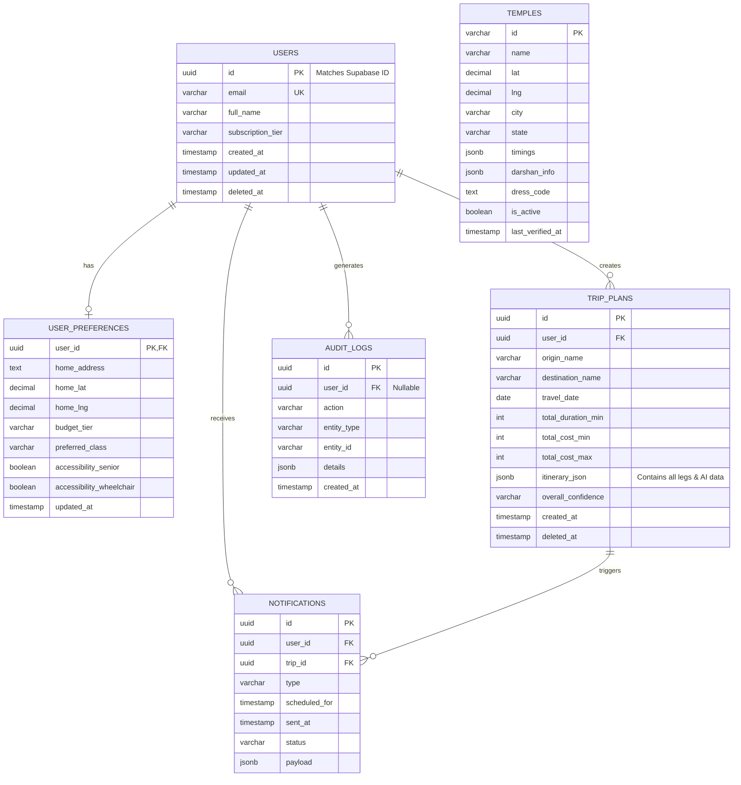

# ER Diagram.md

# TravelMate AI — Entity Relationship Diagram

**Version:** 1.0.0  
**Date:** 2026-07-03

---

## 1. Entity Relationship Diagram

---

## 2. Design Notes

### 2.1 No `trip_legs` Table
Traditional travel apps create separate tables for trips, legs, segments, and transit points. TravelMate AI avoids this by storing the entire itinerary as a `jsonb` column in `TRIP_PLANS`.

**Benefits:**
- Perfect schema flexibility as AI generates new transport combinations.
- Reading a trip is a single query (no complex JOINs).
- Immutable snapshot of the trip exactly as the AI planned it.

### 2.2 Auth Separation
Authentication state (passwords, MFA, social links) lives entirely in Supabase. Our `USERS` table only holds the UUID and profile fields necessary for our application's foreign keys and business logic.

### 2.3 Soft Deletion
`USERS` and `TRIP_PLANS` use `deleted_at` instead of hard deletion. This preserves foreign key integrity in `AUDIT_LOGS` and `NOTIFICATIONS` for historical reporting. A periodic background task anonymizes PII from soft-deleted users after 72 hours (DPDP Act compliance).
